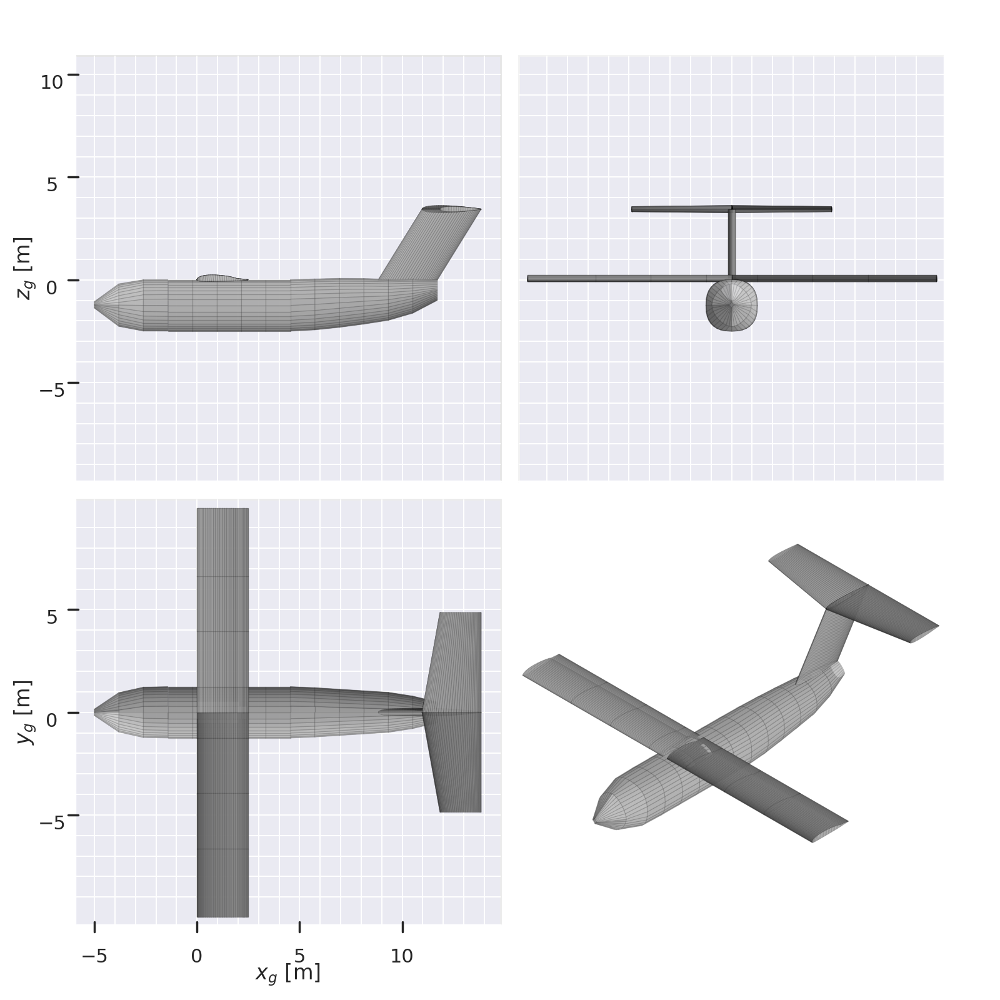

# 1682_team_1

## Bigboi19 Initial sizing specifications (subject to significant change)
MTOW: 16550.0 pound
pow_f: 0.19
struct_f: 0.53
fix_f: 0.28
---------------
W/S: 1484.56 newton / meter ** 2
S: 49.61 meter ** 2

Note that the MTOW is more of an upper bound than a target. Ideally we are a few thousand pounds below MTOW.

### Other geometry params:
Wing span: 19.92 m
Wing aspect ratio: 8.00
Wing mean aerodynamic chord: 2.49 m

### JVL writer:
To update the JVL geometry file, it can either be edited manually or regenerated using the geom.py file. The geom.py file allows for easier, more parametric changes. Currently, geom.py uses tail volume coefficients (and an assumed moment arm length) to size the tail to get a good starting tail size. However, in the future, we will likely want to more manually define the tail geometry.